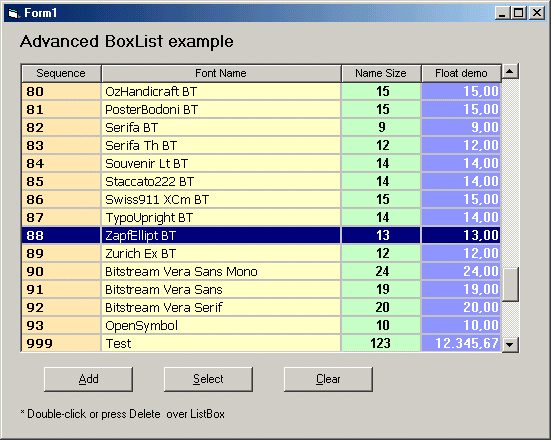



## Advanced ListBox

### Description

This code implements an user control of a listing grid of data where the user can define diverse colors and fonts at the same time, alignment of columns, and several other resources. This component generates three events: Box_Click(), Box_DblClick() and Box_KeyDown(). No DLL, no OCX, pure VB Code!
 
### More Info
 

             |
---                |---
**Submitted On**   |2005-10-23 11:18:32
**By**             |[Eleusmario Mariano Rabelo](https://github.com/Planet-Source-Code/PSCIndex/blob/master/ByAuthor/eleusmario-mariano-rabelo.md)
**Level**          |Advanced
**User Rating**    |4.7 (33 globes from 7 users)
**Compatibility**  |VB 6\.0
**Category**       |[Custom Controls/ Forms/  Menus](https://github.com/Planet-Source-Code/PSCIndex/blob/master/ByCategory/custom-controls-forms-menus__1-4.md)
**World**          |[Visual Basic](https://github.com/Planet-Source-Code/PSCIndex/blob/master/ByWorld/visual-basic.md)
**Archive File**   |[Advanced\_L19427410232005\.zip](https://github.com/Planet-Source-Code/eleusmario-mariano-rabelo-advanced-listbox__1-63002/archive/master.zip)

